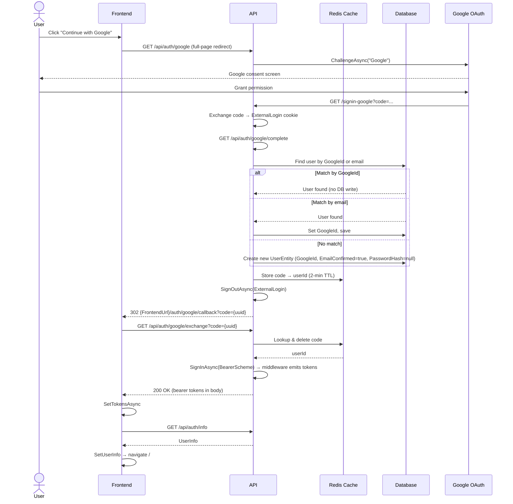
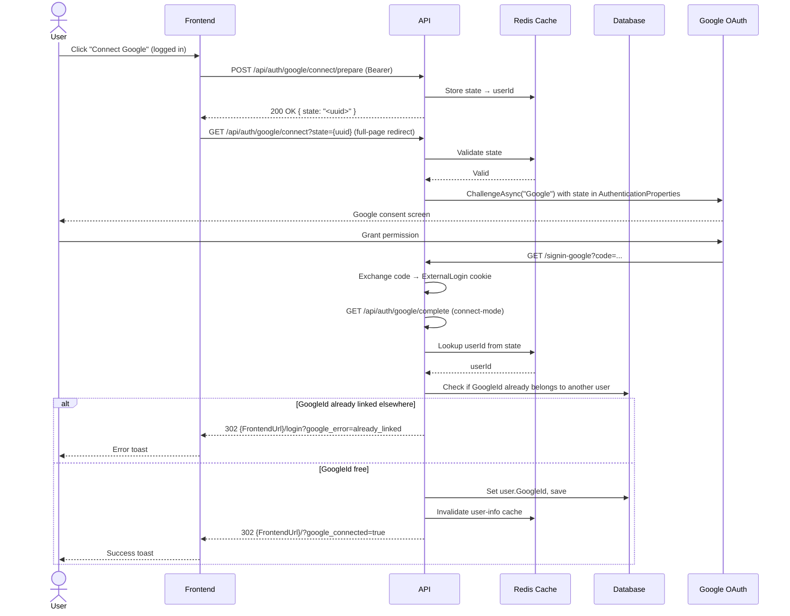
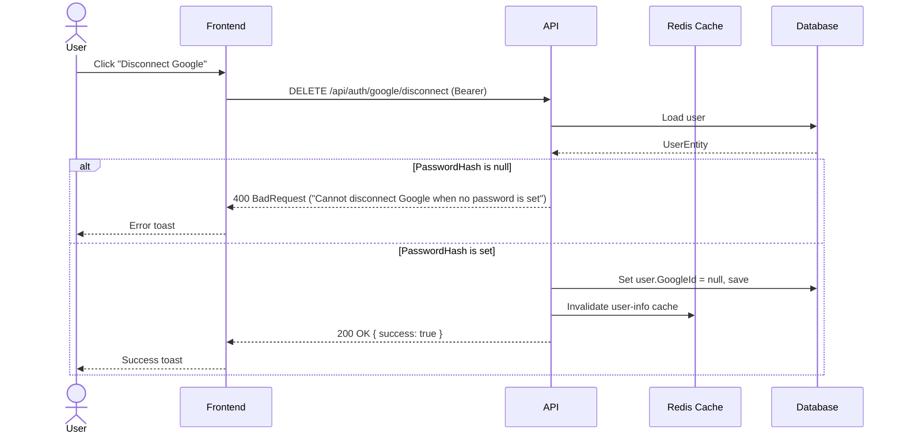

# Google OAuth

## Use Cases

1. **Login with Google** — A user clicks "Continue with Google" on the login page and is authenticated (new account created or existing account found) without entering a password.
2. **Connect Google to existing account** — A logged-in user who registered via email/password connects their account to Google from the Edit User modal.
3. **Disconnect Google** — A user with a Google-connected account (who also has a password set) removes the Google link from their account.

---

## Flows

### Login with Google

```
Frontend → GET /api/auth/google (full-page redirect)
         → Google OAuth → /signin-google (middleware) → ExternalLogin cookie
         → GET /api/auth/google/complete
           - find/create user (see below)
           - cache: code → userId (2-min TTL)
           - SignOutAsync(ExternalLogin)
         → 302 {FrontendUrl}/auth/google/callback?code={uuid}
         → GET /api/auth/google/exchange?code={uuid}
           - SignInAsync(BearerScheme, principal)  ← middleware emits tokens in body
           - TypedResults.Empty
         → Frontend: SetTokensAsync → GetUserInfoAsync → SetUserInfo → navigate /
```



**Find-or-create logic (in `/complete`, login mode):**
1. Match by `GoogleId` → direct login (no DB write)
2. Match by verified Google email → set `GoogleId`, save, login
3. No match → create `UserEntity { GoogleId, Email, UserName (email prefix, de-duped with random suffix on collision), EmailConfirmed=true, PasswordHash=null, SecurityStamp=Guid.NewGuid().ToString(), Roles=[User] }`

### Connect Google to Existing Account

```
Frontend → POST /api/auth/google/connect/prepare (Bearer)
         → returns { state: "<uuid>" }
         → GET /api/auth/google/connect?state={uuid} (full-page redirect)
           - validate state in cache
           - ChallengeAsync("Google") with state in AuthenticationProperties.Items
         → Google OAuth → /signin-google → ExternalLogin cookie
         → GET /api/auth/google/complete (connect-mode, state item present)
           - lookup userId from state cache
           - reject if GoogleId already belongs to another user → 302 {FrontendUrl}/login?google_error=already_linked
           - set user.GoogleId, save, invalidate user-info cache
         → 302 {FrontendUrl}/?google_connected=true
         → Home page shows success toast
```



### Disconnect Google

```
DELETE /api/auth/google/disconnect (Bearer)
  - require user.PasswordHash IS NOT NULL (can't disconnect if no password)
  - set user.GoogleId = null, save
  - invalidate user-info cache
  → 200 { success: true }
```



---

## Endpoints

| Route | Verb | Auth | Notes |
|---|---|---|---|
| `auth/google` | GET | AllowAnonymous | Initiates login |
| `auth/google/connect/prepare` | POST | Authorized | Returns `{ state }` |
| `auth/google/connect` | GET | AllowAnonymous | Initiates connect |
| `auth/google/complete` | GET | AllowAnonymous | OAuth callback handler |
| `auth/google/exchange` | GET | AllowAnonymous | Exchanges code for bearer tokens |
| `auth/google/disconnect` | DELETE | Authorized | Removes GoogleId |

---

## Request / Response Shapes

### `GET /api/auth/google/exchange?code={uuid}`
Response: `200 OK` with bearer token body (emitted by `AddBearerToken` middleware — identical to `/auth/login` response).

### `POST /api/auth/google/connect/prepare`
Response: `200 OK`
```json
{ "state": "<uuid>" }
```

### `DELETE /api/auth/google/disconnect`
Response: `200 OK`
```json
{ "success": true }
```

### `GET /api/auth/info` (updated)
```json
{
  "id": "...",
  "userName": "...",
  "email": "...",
  "emailConfirmed": true,
  "isGoogleConnected": true,
  ...
}
```

---

## Validation Rules

- **Exchange:** code must exist in cache (2-min TTL); one-time use (deleted after exchange). Returns `401` if missing/expired.
- **Connect/prepare:** user must be authenticated (standard Bearer guard).
- **Connect (initiate):** `state` query param must map to an entry in cache; `400` if missing.
- **Complete (connect mode):** `GoogleId` must not already belong to another user; `302` with `?google_error=already_linked` if collision.
- **Disconnect:** user must have a non-null `PasswordHash` to prevent lockout; `400 BadRequest` ("Cannot disconnect Google when no password is set") if null.

---

## Failure Modes

| Scenario | Response |
|---|---|
| Exchange code expired/missing | `401 Unauthorized` |
| GoogleId already linked to another account | `302 {FrontendUrl}/login?google_error=already_linked` |
| Disconnect with no password | `400 BadRequest` |
| Google OAuth error (user denied, etc.) | Google redirects with `error` param; `/complete` redirects `{FrontendUrl}/login?google_error=oauth_failed` |
| Login with a Google-only account via email+password | `401 Unauthorized` — "This account uses Google sign-in. Please continue with Google." |

---

## DB / Migration Impact

- `UserEntity.PasswordHash`: `string?` (nullable, was `required string`)
- `UserEntity.GoogleId`: `string?`, filtered unique index (`WHERE "GoogleId" IS NOT NULL`) allowing multiple NULLs in Postgres
- Migration: `AddGoogleAuth`

---

## Config

```json
"GoogleOAuth": {
  "ClientId": "",
  "ClientSecret": "",
  "FrontendUrl": "https://your-frontend-domain.com"
}
```

Secrets injected via CI/CD environment variables (same pattern as `R2` settings). Never committed.

---

## Architecture Notes

### Why Redis is Required

Redis is needed because the OAuth flow is **redirect-based** — the browser hops between your API and Google, so you can't hold state in memory or pass it directly in the response.

**Exchange Code (Login flow):** After `/complete` verifies the Google identity, it can't directly return tokens — the browser is mid-redirect. So it stores `code → userId` in Redis with a 2-min TTL, then redirects the frontend to `/auth/google/callback?code={uuid}`. The frontend calls `/exchange?code=...` to claim the tokens. The code acts as a short-lived, one-time bridge between the OAuth callback and token issuance.

**Connect State (Connect flow):** When a logged-in user initiates a Google connect, the API needs to know *which user* triggered it once Google redirects back — because the redirect loses the original Bearer token context. So it stores `state → userId` in Redis before the redirect and reads it back in `/complete`.

A database would work functionally but Redis is the right fit here: these are **ephemeral entries** (2-min TTL) with automatic cleanup, not domain data worth persisting.

### The `/signin-google` Endpoint

`/signin-google` is **not** a custom endpoint in the codebase. It is the **default `CallbackPath`** automatically registered by ASP.NET Core's Google OAuth middleware when calling `.AddGoogle(...)` in `DependencyInjection.cs`:

```csharp
.AddGoogle(options =>
{
    options.ClientId = appSettings.GoogleOAuth.ClientId;
    options.ClientSecret = appSettings.GoogleOAuth.ClientSecret;
    options.SignInScheme = Constants.ExternalScheme;
    // options.CallbackPath defaults to "/signin-google"
});
```

The middleware intercepts `GET /signin-google` internally before any controller or minimal API route sees it. It:
1. Validates the `code` + `state` params received from Google
2. Exchanges the code for an access token with Google's token endpoint
3. Builds a `ClaimsPrincipal` from Google's user info
4. Signs in under the `ExternalLogin` scheme → sets the ExternalLogin cookie
5. Redirects to your `/api/auth/google/complete`

This is why it appears in the sequence diagram but has no corresponding file in the repository.

---

## Open Decisions

- **Local dev without Redis:** exchange-code and connect-state cache lookups silently return null, so the flow fails. Requirement: Redis must be running locally (`RedisEnabled: true`) to test Google OAuth end-to-end.
- **Username collision:** new Google users get a username derived from the email prefix (e.g. `john.doe` from `john.doe@gmail.com`). On collision, append a short random 4-char hex suffix (e.g. `john.doe-a3f1`).
- **Google Cloud Console:** the OAuth callback URL `{ApiBaseUrl}/signin-google` must be registered as an authorized redirect URI. `FrontendUrl` must match `AllowedSpecificOrigins`.
